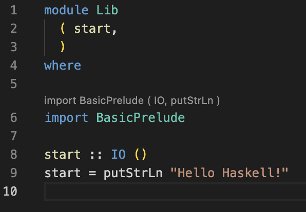

# Setup

Mac & Linux:
    - Install ghcup `curl --proto '=https' --tlsv1.2 -sSf https://get-ghcup.haskell.org | sh`
        - Press Enter
        - Let the executable add the required stuff to the PATH
        - Install hls and stack
        - The CLI will print a list of package names, ensure the necessary packages are installed on your system

Windows: 
    - Install ghcup by pasting this in a PowerShell session: `Set-ExecutionPolicy Bypass -Scope Process -Force;[System.Net.ServicePointManager]::SecurityProtocol = [System.Net.ServicePointManager]::SecurityProtocol -bor 3072;Invoke-Command -ScriptBlock ([ScriptBlock]::Create((Invoke-WebRequest https://www.haskell.org/ghcup/sh/bootstrap-haskell.ps1 -UseBasicParsing))) -ArgumentList $true`    

For reference: https://www.haskell.org/ghcup/steps/

For all operating systems afterwards:
- Run `ghcup install ghc 9.2.5`
- Run `ghcup set ghc 9.2.5`
- Install vscode
- Install the Haskell VsCode extension (ID: haskell.haskell)
- Clone the repository
- Run `stack build` to download and compile all dependencies (this should take a while)
- Open the project in VSCode and open `src/Hangman/GameState.hs`
- If a popup appears, choose to automatically discover tools via GHCUp (otherwise the option is probably set correctly by default)
- Write something to make the program invalid. You should get syntax highlighting in a few seconds. If not check the output of the Haskell VSCode extension.



It should look like this (there is some highlighting and some information about the import)

You can write
`-- >>> some valid Haskell expression` in the file

to run any function defined in the file and view the result

For example
`-- >>> 1 + 1` should bring up the VSCode "evaluate" option and produce `2`.

Run `stack run hangman` in the console to build and run the application (`app/Hangman.hs`). This should print "Starting hangman. Type in a word to guess." to the console. Don't worry, the application is not supposed to work correctly yet :)

Run `stack test` to run tests (there is just one single test as a template right now). This should finish with
```
workshop> Test suite spec failed
```
which is fine, since you haven't completed the exercises yet.

# Troubleshooting

## Haskell Language Server / VSCode shows strange errors

Sometimes, the language server gets stuck or does not restart correctly after configuration changes.
Ctrl+Shift+P -> Restart Haskell Language Server should help.

## stack build fails because of zlib

Make sure the zlib C library is installed on your system.
On ubuntu, I managed to resolve the issue by running `apt-get install zlib1g`.

# Helpful tools

https://hoogle.haskell.org/ or alternatively the Haskell Spotlight extension.

https://tryhaskell.org/ if for some reason we cannot get the VSCode setup to work

# Exercises

## Ex0

Optional, easy exercises. You can skip this at any point if you like.
Go to `src/Syntax/Examples.hs`.

## Ex1-2

Start in the file `src/Hangman/GameState.hs`.
The file has a lot of comments trying to explain what is going on and some small TODOs.

## Ex3-4

The file `src/Mastermind/GameState.hs` has even more issues.
Complete the TODOs to play mastermind in the console.

## Ex5

Complete the TODO in `src/Mastermind/Program.hs`.

## Ex6

Optional. 

Here are some ideas what you could do:
1. Write your own little game. As an example, I added a TicTacToe file, but you can go with whatever you like.
   You can also write tests for your game in the `test` folder.
2. Make your game playable in the Browser by using websockets. There is some small setup in `src/Web.hs`, which should work
   if you uncomment the missing dependencies in `package.yaml`.
   If you want to you can try to refactor code so that you can add more games easily just providing a `handleInput` function
   and `FromJSON/ToJSON` instances for the input/output types.
3. Complete some [Advent of Code](https://adventofcode.com/) exercises in Haskell.
4. Take a look/try to do some type-level stuff. Haskells type system is complicated but very expressive.
   I provided an example under `src/Uno/Card.hs` that makes sure during compile time that only valid cards are able to be played.

# Learning material

http://learnyouahaskell.com/chapters

https://serokell.io/blog/10-reasons-to-use-haskell
